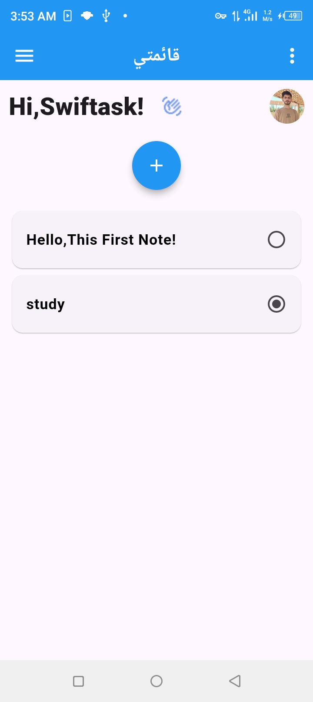
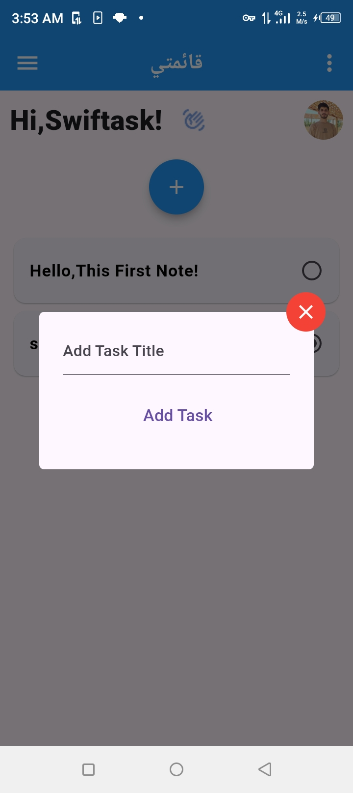

# 📋 SwiftTask

SwiftTask is a simple and easy-to-use **To-Do List** application built with Flutter.  
It allows you to **add tasks**, **view them**, and **mark tasks as completed** with a clean and minimal interface.

## ✨ Features
- Add new tasks easily.
- Mark tasks as completed or pending.
- Simple and intuitive UI.
- **State management with Provider** for efficient and reactive updates.
- Full Arabic language support.

## 🖼 Screenshots
| Home Screen | Add Task Screen |
|-------------|----------------|
|  |  |

## 🛠 Technologies Used
- **Flutter** - Cross-platform UI toolkit.
- **Provider** - State management solution.
- **Dart** - Programming language for Flutter.

## 🚀 Getting Started

### Prerequisites
Make sure you have:
- Flutter SDK installed
- Dart SDK installed
- Android Studio or VS Code

### Installation
1. Clone the repository:
   ```bash
   git clone https://github.com/YourUsername/SwiftTask.git
